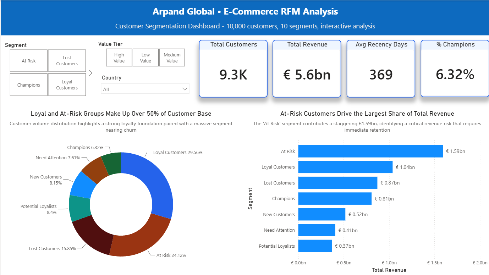
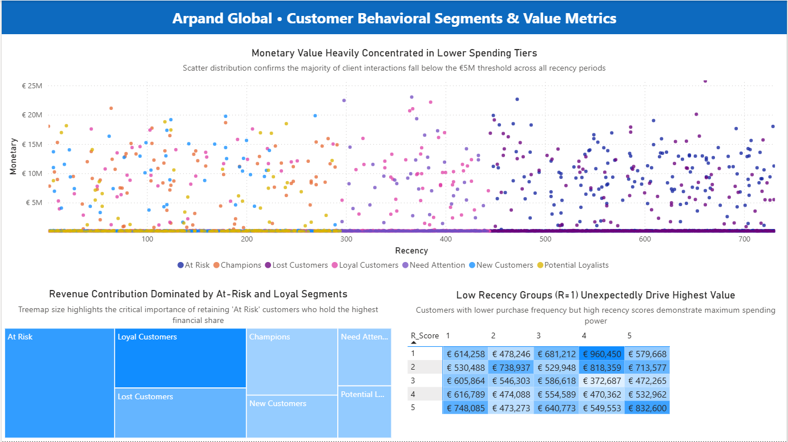
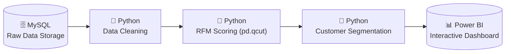

<div align="center">

# 📊 RFM Customer Segmentation Analysis
### Arpand Global E-Commerce Dataset

**Mengubah 10.000 baris data transaksi menjadi strategi retensi pelanggan yang actionable.**


</div>

---

## 📑 Daftar Isi

- [Dashboard](#-dashboard)
- [Ringkasan Eksekutif](#-ringkasan-eksekutif)
- [Tentang Dataset](#-tentang-dataset)
- [Pertanyaan Bisnis](#-pertanyaan-bisnis)
- [Metrik Utama](#-metrik-utama)
- [Alur Kerja Teknis](#-alur-kerja-teknis)
- [Insight Utama & Rekomendasi Bisnis](#-insight-utama--rekomendasi-bisnis)
- [Tools & Skills](#-tools--skills)
- [Limitasi](#-limitasi)
- [Struktur Repository](#-struktur-repository)

---

## 📸 Dashboard

Dashboard interaktif dibangun di Power BI dengan 3 halaman: **Executive Overview**, **RFM Deep Dive**, dan **Geographic View** — lengkap dengan 9 DAX measures dan filter yang tersinkron di seluruh halaman.

<div align="center">
    
| Executive Overview | RFM Deep Dive |
|---|---|
|  |  |
| KPI utama, distribusi segmen, revenue per segmen | Scatter plot RFM, treemap, heatmap R×F score |

</div>

📂 File dashboard: [`dashboard/RFM_Customer_Segmentation.pbix`](dashboard/RFM_Customer_Segmentation.pbix)

---

## 📌 Ringkasan Eksekutif

Sebagian besar bisnis e-commerce memperlakukan semua pelanggan secara sama — email yang sama, promo yang sama, retargeting yang sama. Proyek ini membuktikan bahwa pendekatan tersebut membuang budget marketing pada pelanggan yang sudah tidak akan kembali, sementara pelanggan paling loyal tidak mendapat perlakuan istimewa yang seharusnya mereka terima.

Menggunakan **RFM Analysis** (Recency, Frequency, Monetary) pada 10.000 pelanggan Arpand Global E-Commerce, proyek ini mengelompokkan pelanggan ke dalam 7 segmen berbasis perilaku, lalu menerjemahkan setiap segmen menjadi rekomendasi marketing yang spesifik dan bisa langsung dieksekusi.

<div align="center">

| 👥 Total Pelanggan | 💰 Total Revenue | ⭐ Champions + Loyal | ⚠️ Segmen Berisiko |
|:---:|:---:|:---:|:---:|
| **10.000** | **€5,6 miliar** | **36% populasi → 33% revenue** | **24% populasi, 28% revenue** |

</div>

**Insight inti:** Lebih dari sepertiga pelanggan (Champions + Loyal) hanya menyumbang 33% dari total pendapatan. Risiko terbesar justru berada pada segmen At Risk, yang saat ini menjadi penyumbang pendapatan terbesar perusahaan (28% dari total revenue). Karena segmen ini mulai menunjukkan tanda-tanda berhenti berlangganan (churn), strategi reaktivasi dan retensi pada kelompok ini harus menjadi prioritas utama demi menyelamatkan stabilitas keuangan bisnis dengan ROI tercepat.

---

## 🗂️ Tentang Dataset

| Atribut | Detail |
|---|---|
| **Sumber** | Arpand Global E-Commerce Dataset |
| **Jumlah baris (mentah)** | 10.000 pelanggan |
| **Jumlah baris (setelah cleaning)** | ±9.301 pelanggan valid |
| **Granularitas** | 1 baris = 1 pelanggan (data sudah teragregasi per customer) |
| **Cakupan geografis** | 7+ negara (Kanada, Singapura, AS, Brazil, Japan, Jerman, Australia, dll.) |
| **Kolom kunci** | `CustomerID`, `LastPurchaseDate`, `TotalTransactions`, `TotalSpent`, `Country`, `PaymentType` |
| **Tabel pendukung** | `transactions.csv`, `branches.csv`, `ad_history.csv`, `aggregate.csv` |

---

## ❓ Pertanyaan Bisnis

Proyek ini dirancang untuk menjawab pertanyaan yang nyata-nyata ditanyakan tim marketing, bukan sekadar eksplorasi data:

1. Siapa pelanggan paling berharga, dan apa yang membuat mereka berbeda dari yang lain?
2. Pelanggan mana yang berisiko churn dan masih bisa diselamatkan dengan budget terbatas?
3. Berapa kontribusi revenue dari setiap segmen — apakah sesuai proporsi populasinya?
4. Negara mana yang sebaiknya menjadi prioritas ekspansi atau retensi?
5. Strategi marketing apa yang paling tepat untuk setiap kelompok pelanggan?

---

## 📐 Metrik Utama

| Metrik | Definisi | Insight Bisnis |
|---|---|---|
| **Recency (R)** | Jumlah hari sejak transaksi terakhir | Makin kecil = makin "hangat" relasinya dengan brand |
| **Frequency (F)** | Total jumlah transaksi pelanggan | Indikator kebiasaan beli dan loyalitas |
| **Monetary (M)** | Total nilai belanja (EUR) | Indikator nilai ekonomis pelanggan |
| **RFM Score** | Gabungan skor R-F-M (1–5 tiap dimensi) | Contoh: `555` = Champions, `111` = Lost Customer |
| **Segment** | Label hasil kombinasi skor RFM | 7 segmen aktual: At Risk, Loyal Customers, Lost Customers, Champions, New Customers, Need Attention, Potential Loyalists |
| **Avg Recency keseluruhan** | 369 hari | Rata-rata pelanggan terakhir bertransaksi ~1 tahun |

---

## ⚙️ Alur Kerja Teknis



**Tahapan kerja:**

1. **MySQL — Penyimpanan & Ekstraksi Data Mentah.** Seluruh dataset disimpan di MySQL. Query SQL hanya menghitung Recency mentah (`DATEDIFF`) serta menarik Frequency dan Monetary apa adanya — **tanpa scoring** di tahap ini.
2. **Python — Data Cleaning.** Menghapus anomali (`Age > 120`), duplikat `CustomerID`, dan transaksi dengan `Monetary ≤ 0` sebelum data digunakan untuk kalkulasi apa pun.
3. **Python — RFM Scoring.** Skor R/F/M (1–5) dihitung dengan `pd.qcut` **setelah** data bersih — bukan dengan `NTILE()` di SQL sebelum cleaning. Keputusan ini disengaja: scoring berbasis kuantil yang dihitung dari data kotor akan menghasilkan batas skor yang terdistorsi outlier.
4. **Python — Segmentasi.** Kombinasi skor R-F-M diterjemahkan ke 7 segmen pelanggan menggunakan logika pemasaran (bukan clustering otomatis), supaya hasilnya mudah diinterpretasikan oleh tim non-teknis.
5. **Power BI — Visualisasi.** Hasil akhir diimpor ke Power BI: 3 halaman dashboard, 7 visualisasi (KPI Cards, Donut, Bar Chart, Scatter Plot, Treemap, Heatmap Matrix, Filled Map), dan 9 DAX Measures untuk kalkulasi dinamis sesuai filter.

> 💡 **Keputusan metodologis kunci:** RFM scoring sengaja tidak dilakukan di SQL meski secara teknis bisa (`NTILE`). Validasi dilakukan dengan memastikan Champions memiliki Recency terkecil dan Lost Customers memiliki Recency terbesar — bukti bahwa logika kuantil bekerja sesuai harapan setelah data dibersihkan.

---

## 💡 Insight Utama & Rekomendasi Bisnis

| Segmen | Insight | Rekomendasi |
|---|---|---|
| **Champions** (6% populasi) | Beli paling baru, paling sering, nilai tertinggi. Menyumbang 14% revenue meski hanya 6% populasi. | Loyalty exclusives, early access produk baru, jadikan brand ambassador. |
| **Loyal Customers** (30% populasi) | Segmen terbesar, kontributor revenue tunggal terbesar nomor dua 19%. | Upsell ke produk premium — cross-sell lebih murah daripada akuisisi baru. |
| **At Risk** (24% populasi) | Dulu heavy buyer, kini recency rata-rata 592 hari. Revenue historis penyumbang tertinggi (28% dari total). | Email reaktivasi personal + diskon eksklusif dengan batas waktu jelas. |

**Insight geografis:** Singapura adalah kontributor revenue terbesar — kandidat kuat untuk alokasi budget marketing tambahan dibanding negara dengan revenue lebih rendah pada basis pelanggan yang sama besar.

---

## 🛠️ Tools & Skills

| Kategori | Tools | Skill yang Didemonstrasikan |
|---|---|---|
| **Database** | MySQL | SQL queries, View, DATEDIFF, window function |
| **Data Processing** | Python — Pandas, NumPy | Data cleaning, outlier handling, `pd.qcut`, fungsi segmentasi kustom |
| **Visualisasi Eksplorasi** | Plotly, Seaborn, Matplotlib | Scatter plot, treemap, heatmap untuk validasi data |
| **Business Intelligence** | Power BI, DAX | Data modeling, calculated measures, dashboard interaktif 3 halaman |
| **Analytical Thinking** | — | Validasi logika scoring, dokumentasi keputusan cleaning, penerjemahan data → rekomendasi bisnis |

---

## ⚠️ Limitasi

- Dataset bersifat **snapshot** (satu titik waktu), bukan time-series — analisis tren bulanan/musiman tidak dapat dilakukan dengan data ini.
- Segmentasi menggunakan **rule-based logic**, bukan unsupervised clustering (K-Means) — dipilih secara sengaja agar mudah diinterpretasikan tim non-teknis, namun berarti batas antar-segmen bersifat tetap, bukan adaptif terhadap distribusi data baru.
- Tidak ada data **Customer Lifetime Value (CLV)** prediktif atau analisis cohort — RFM ini bersifat deskriptif terhadap perilaku historis, bukan prediksi perilaku masa depan.
- Dataset kemungkinan bersifat **sintetis/teranonimkan** (sumber Kaggle) — pola perilaku belanja mungkin tidak sepenuhnya merepresentasikan kondisi pasar riil.
- Reference data `branches.csv` dan `ad_history.csv` belum dimanfaatkan sepenuhnya — peluang pengembangan lanjutan untuk analisis efektivitas kampanye per cabang.

---

## 📁 Struktur Repository

```
rfm-customer-segmentation/
├── README.md
├── data/
│   ├── raw/
│   │   └── arpand_ecommerce_dataset.csv
│   └── processed/
│       └── rfm_segmented.csv
├── sql/
│   └── 01_extract_raw_rfm.sql
├── notebooks/
│   └── rfm_cleaning_scoring_segmentation.ipynb
├── dashboard/
│   └── RFM_Customer_Segmentation.pbix
└── assets/
    ├── dashboard_overview.png
    └── dashboard_deepdive.png
```

---

<div align="center">

**Dylan Tirta Adhitama** · Fresh Graduate Management · Aspiring Data/Marketing Analyst
📧 dylantirtaadhitama@gmail.com · 🔗 [LinkedIn](https://linkedin.com/in/username) · 💻 [GitHub](https://github.com/username)

</div>
